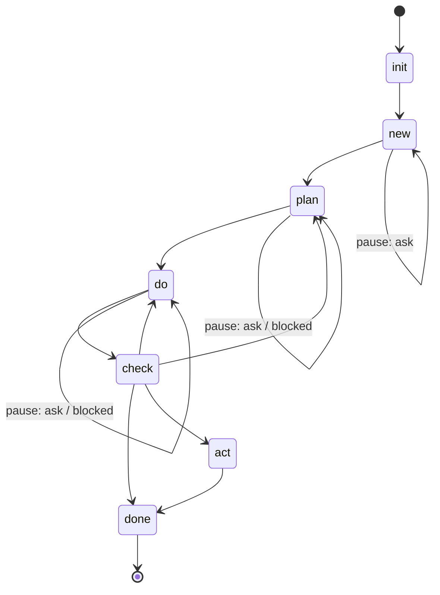

# Agent Levers

[](https://github.com/fmind/agent-levers/actions/workflows/ci.yml) [](./LICENSE) [](https://github.com/anthropics/claude-code) [](https://github.com/google-gemini/gemini-cli) [](https://github.com/features/copilot)

> **Multiply the agent's force, divide the human's effort.**
>
> 

Agent Levers is a workflow toolkit for AI coding agents. It ships as a small set of Agent Skills — file-based, harness-agnostic — that bring structure (plan → do → check → act) to any non-trivial coding task. The same `skills/` tree runs in Claude Code, Gemini CLI, and GitHub Copilot.

## Why this exists

A coding agent is only as useful as the spec you give it.

- Type too little → the agent hallucinates intent, drifts, ships the wrong thing.
- Type too much → you become the bottleneck, doing the agent's homework.

Agent Levers flips the balance. You put in the minimum; the agent carries the weight — clarifying, planning, executing, verifying, learning.

## What you get

- **Minimum input.** A one-line ask becomes a runnable acceptance checklist with stable IDs (`C1`, `C2`, …) and typed verifiers (`shell`, `visual`, or `manual`).
- **One chain command.** `/lever <id>` advances the lever through plan → do → check → act → done — autonomously, until it pauses for input or finishes.
- **Self-verifying.** Every criterion ships a `verify:` block. Check re-runs them as ground truth from a fresh shell — no agent self-grading, no "trust me, it works."
- **Bounded execution.** Do runs inside an explicit `budget:` (iterations, minutes, streak), so it can pause, resume, hand off, or run overnight without runaways.
- **File-based state.** Two artifacts per lever — `lever.yaml` (machine state, validated against `lever.schema.json`) and `LEVER.md` (single narrative). LEVER.md opens with `## TL;DR` (≤ 20 lines, rewritten on every step). Skim 20 lines, know everything that matters.
- **Self-improving.** When a task exposes a recurring gap, act stages a reviewable diff to your `AGENTS.md`, edits a step procedure in place, or surfaces a follow-up `/lever-new` when the gap implies project work rather than a rule.
- **One source, every agent.** The same skills work in Claude Code, Gemini CLI, and GitHub Copilot — install once, use everywhere.

## The four commands

- **`/lever-init`** — Bootstrap a fresh repo. Creates `.agents/levers/`, wires `CLAUDE.md` / `GEMINI.md` to import `AGENTS.md`, prints an `AGENTS.md` skeleton if one is missing.
- **`/lever-new <title>`** — Start a new lever. First turn is chat-only — clarifying questions, proposed enhancements, draft brief inline. On agreement, captures `LEVER.md` §Brief and seeds `lever.yaml` with `step: plan`.
- **`/lever <id-or-slug>`** — Advance the lever chain. Default: runs autonomously until paused (`pause` set) or finished (`step: done`). The chain steps themselves (`plan`, `do`, `check`, `act`) aren't user-facing — the dispatcher loads the matching `skills/lever/references/<step>.md` on demand.
- **`/lever-status [<id-or-slug>]`** — List levers (no args), inspect one (TL;DR + criteria summary + per-criterion events timeline), or cancel one with `<id> cancel [<reason>]`. Read-only by default — never advances the chain.

Two contracts hold the framework together:

- **Checklist contract** — every criterion in `lever.yaml.criteria` carries a stable `id`, a typed `verify:` block (shell / visual / manual), and a `passes: false` flag. Do flips it on success; check re-runs it as ground truth. Do runs inside `lever.yaml.budget` (iterations, minutes, streak) so runaways stop cleanly.
- **Chaining contract** — `lever.yaml.step` is the single state pointer (`plan | do | check | act | done | cancel`); the optional `lever.yaml.pause` (`ask | blocked`) is set only when the chain is halted at `step` waiting for the user, and only ever at `step: plan` or `step: do`. Check and act always advance, route back, or finish — they never pause. The dispatcher reads `(step, pause)` to route the next action; the chat reply communicates the same state in plain language.

## Walkthrough

Two human inputs drive a complete lever, in two separate sessions.

**Session 1 — capture intent.**

```text
$ /lever-new add password sign-in
  → first turn: chat-only — clarifying questions, proposed enhancements, draft brief inline
  → on agreement: creates .agents/levers/1-add_password_sign_in/
  → writes LEVER.md (TL;DR + §Brief) and lever.yaml seed (lever_id, slug, step: plan)
  → "Brief captured; lever.yaml + LEVER.md written. In a new session, run /lever 1 to start the chain."
```

`/lever-new` doesn't invoke `/lever` itself — brief-time conversation is high-context and human-driven; chain execution is mechanical and reads from files. Each session does one thing well.

**Session 2 — run the chain.**

```text
$ /lever 1
  → fresh session. dispatcher reads lever.yaml.step (plan), runs the chain autonomously
  → plan: investigates codebase, populates lever.yaml.criteria + budget, appends LEVER.md §Plan; advances to step: do
  → do: executes the plan inside lever.yaml.budget; appends per-event rows to lever.yaml.criteria[i].events; flips per-criterion passes; on green appends LEVER.md §Do; advances to step: check
  → check: re-runs verifiers from a fresh shell, audits the chain, edits §Do §Coverage in place, lifts hints into lever.yaml.hints; advances to step: act (if hints non-empty) or step: done (if empty)
  → act (only if hints surfaced): investigates each hint, edits AGENTS.md / skills, recommends follow-up /lever-new; appends §Act; advances to step: done
  → "Ran: plan → do → check → act. All 4/4 verifiers passed. 2 hints landed (AGENTS.md +5/-0). Optional follow-up: /lever-new enforce_route_middleware_lint."
```

The chain stops on a pause (`pause: ask` or `pause: blocked`) at plan or do, or on a terminal state (`step: done` or `step: cancel`). If do hits a `type: visual` or `type: manual` criterion, it halts with `pause: ask`; the user confirms in chat and re-invokes `/lever 1` to resume.

Inspect a lever any time:

```text
$ /lever-status 1
  → prints TL;DR + criteria summary + per-criterion events timeline (inline when events exist)
  → "4 criteria · 6 events total · 1 cap-fold at C3."
```

See [`examples/levers/1-add_password_sign_in/`](./examples/levers/1-add_password_sign_in/) for a full happy-path walkthrough, and [`examples/levers/2-fix_dropdown_ios_close/`](./examples/levers/2-fix_dropdown_ios_close/) for a scenario where check routes back to do.

## Install

### Claude Code

```text
/plugin marketplace add fmind/agent-levers
/plugin install agent-levers@agent-levers
```

For local development, point the marketplace at a clone:

```text
/plugin marketplace add /path/to/agent-levers
/plugin install agent-levers@agent-levers
```

### Gemini CLI

```bash
gemini extensions install fmind/agent-levers
```

For local development (live-link, edits reload on next session):

```bash
gemini extensions link /path/to/agent-levers
```

### GitHub Copilot

Copilot CLI:

```bash
copilot plugin install fmind/agent-levers
```

VS Code — point `chat.pluginLocations` at a local clone:

```jsonc
// settings.json
"chat.pluginLocations": {
  "/path/to/agent-levers": true
}
```

## Reference

### Layout

```text
agent-levers/
├── AGENTS.md                          # canonical context — read by Copilot; @-included by CLAUDE.md / GEMINI.md
├── lever.schema.json                  # JSONSchema for end-user lever.yaml files
├── skills/                            # Agent Skills (open standard)
│   ├── lever-init/SKILL.md            # user-facing: bootstrap a repo
│   ├── lever-new/SKILL.md             # user-facing: start a new lever (writes §Brief)
│   ├── lever-status/SKILL.md          # user-facing: list / detail / cancel levers
│   └── lever/                                            # user-facing: dispatcher
│       ├── SKILL.md                                      # auto-chains
│       └── references/{plan,do,check,act}.md             # step procedures (loaded on demand)
├── .claude-plugin/                    # Claude Code plugin manifest + bundled marketplace
├── gemini-extension.json              # Gemini CLI extension manifest
├── plugin.json                        # GitHub Copilot manifest
└── .github/workflows/ci.yml           # lint + lever.yaml schema validation
```

In an end-user project after `/lever-init`:

```text
.agents/levers/<id>-<slug>/
├── lever.yaml          # machine state (step, optional pause, criteria with per-criterion events log, budget, decisions, hints); validated against lever.schema.json
└── LEVER.md            # single narrative — opens with `## TL;DR`, then §Brief, §Plan, §Do, §Check, §Act (each appears when its step runs)
```

The per-event do audit lives in `lever.yaml.criteria[i].events`; render it inline via `/lever-status <id>`. Cross-task project knowledge (auth flow, schema, shared notes) belongs in whatever docs/memory skill the project already uses — install one alongside agent-levers if you need that surface.

### State machine

`lever.yaml.step` is the single state pointer (`plan | do | check | act | done | cancel`). `lever.yaml.pause` is optional and present only when the chain is halted at `step` waiting for the user (`ask` = open question or fork; `blocked` = external blocker like auth, env, budget) — and only ever at `step: plan` or `step: do`. The pair `(step, pause)` is the full state. Check and act always advance, route back, or finish — they never pause.



`init` and `new` are user-typed entries (`/lever-init`, `/lever-new`); the chain steps `plan → do → check → act → done` advance via the dispatcher (`/lever <id>`). `done` is terminal — the diff hands off to the user. `cancel` is a terminal state set via `/lever-status <id> cancel [<reason>]` (see "Cancelling a lever" below); no transition leads to it from the procedures.

The chain reply communicates `(step, pause)` in plain English; no fixed line format. When referencing a criterion, name it by `id` (e.g., `C3`) so the reference stays stable across edits. Examples:

```text
"Brief captured; ready to plan. Run /lever 1 next."
"Plan written; 4 acceptance criteria defined. Run /lever 1 next."
"Every criterion passes (4/4). Run /lever 1 next."
"Failing on C3 (rate-limit verifier exit 1; 3/4 passing). Run /lever 1 to resume do."
"All 4/4 verifiers passed. 2 hints surfaced. Continuing into act."
"All 4/4 verifiers passed. No hints. Done — diff is staged."
"Proposals staged across AGENTS.md (+5/-0). Optional follow-up: /lever-new enforce_route_middleware_lint."
"Paused at plan (ask): rate-limit policy for the public endpoint? Project conventions don't dictate."
"Paused at plan (ask): persist sessions in Postgres or Redis?
   - Postgres — already in stack; adds load to primary DB
   - Redis — fast, but new ops surface to maintain"
"Paused at do (ask): confirm visual on C7? Screenshot at docs/visual/login-mobile.png."
"Paused at do (blocked): budget exhausted (max_streak; 5/6 passing). Raise the limit or narrow scope, then re-invoke /lever 1."
"Blocked: levers directory (.agents/levers/) is gitignored. Remove the entry from .gitignore and re-run /lever-init."
```

Per-step shapes live in each `skills/lever/references/<step>.md` §Hand off — that's the source of truth.

### Cancelling a lever

```text
$ /lever-status 1 cancel out of scope after replanning
  → writes lever.yaml: step: cancel, drops any pause, bumps updated_at
  → rewrites LEVER.md ## TL;DR with the cancellation block (incl. the reason if you provided one)
  → "Lever 1 cancelled. Directory stays at .agents/levers/1-add_password_sign_in/ for archival."
```

The reason is optional — pass everything after `cancel`, or omit it entirely. After cancellation, the lever shows up under `/lever-status` as cancelled and the directory stays intact for archival. `/lever <id>` won't run further procedures on it.

## Contributing

Issues and PRs welcome. Two house rules to keep the framework lean:

- **Skill files have line caps** (see `AGENTS.md` §Conventions) — they load into agent context on every run, so verbosity costs budget.
- **Examples are CI-validated.** Every `examples/levers/*/lever.yaml` is checked against `lever.schema.json` on every push.

For non-trivial changes, the repo dogfoods its own framework: `/lever-new <title>` to capture intent, `/lever <id>` to drive the chain.

## License

MIT — see [LICENSE](./LICENSE).
